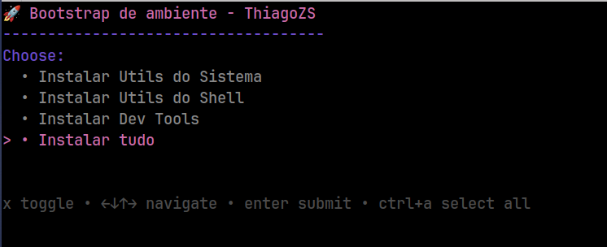

# dotfiles-v2

Automação para transformar uma máquina Ubuntu/Debian zerada em um ambiente completo de desenvolvimento. Os scripts usam [`gum`](https://github.com/charmbracelet/gum) para menus interativos e permitem instalar tanto utilidades de sistema quanto ferramentas de shell e stacks de desenvolvimento.



## Conteúdo

- `bootstrap.sh`: orquestra a instalação e permite selecionar quais grupos rodar.
- `install_system_utils.sh`: Docker, Docker Compose, VS Code, Slack, Discord, Homebrew.
- `install_shell_utils.sh`: Zsh, Oh My Zsh, temas/plugins, ferramentas de terminal (fzf, ripgrep, bat, zoxide etc.).
- `install_dev_tools.sh`: Git, Make, Python, Go (goenv), Node (nodenv), Postgres, sqlite, jq, httpie, GitHub CLI, build-essential, Docker Buildx, Redis CLI.

## Pré-requisitos

- Ubuntu/Debian recente (testado em Ubuntu 24.04).
- Acesso sudo.
- `gum` é instalado automaticamente caso não exista.

## Passo a passo (rodando direto na máquina)

```bash
git clone <repo>
cd dotfiles-v2
chmod +x ./*.sh
./bootstrap.sh
```

Escolha "Instalar tudo" ou marque apenas os grupos desejados.

- Ao escolher **"Instalar tudo"**, o bootstrap chama os três módulos na sequência e, internamente, exporta `DOTFILES_INSTALL_ALL=1` para que cada instalador aplique **todas** as opções automaticamente.
- Quando você abre qualquer menu, todas as opções já vêm pré-selecionadas; basta pressionar `Enter` para aceitar tudo (use `Espaço` para desmarcar itens).
- Se quiser pular o menu e instalar tudo direto (por exemplo em scripts/CI), rode `DOTFILES_INSTALL_ALL=1 ./bootstrap.sh`.

## Como testar na VM `dotfiles-test` (Multipass)

1. **Criar/zerar a VM**
   ```bash
   multipass stop dotfiles-test 2>/dev/null || true
   multipass delete dotfiles-test 2>/dev/null || true
   multipass purge || true
   multipass launch 24.04 --name dotfiles-test
   ```
2. **Copiar o repositório para a VM**
   ```bash
   multipass transfer -r ~/workspace/dotfiles-v2 dotfiles-test:/home/ubuntu/
   ```
3. **Executar o bootstrap**
   ```bash
   multipass exec dotfiles-test -- bash -lc 'cd ~/dotfiles-v2 && TERM=xterm ./bootstrap.sh'
   ```
   > Se quiser automatizar as escolhas em ambientes não interativos, crie um wrapper para `gum choose` usando uma variável `GUM_CHOOSE_RESPONSES_FILE`, como feito durante os testes.
4. **Validar rapidamente**
   ```bash
   multipass exec dotfiles-test -- docker --version
   multipass exec dotfiles-test -- zsh --version
   multipass exec dotfiles-test -- git --version
   ```

## Por trás dos scripts

- **Menus seguros:** `mapfile` captura as escolhas do `gum` preservando textos com espaços.
- **Idempotência básica:** trechos como instalação do Oh My Zsh, tema Spaceship e plugins conferem se já existem antes de clonar novamente.
- **Fallbacks:** quando `exa` não existe em Ubuntu 24.04, o script tenta instalar `eza`.
- **Zsh sem prompt de senha:** `sudo chsh -s "$(which zsh)" "$USER"` evita bloqueios quando o script roda sem TTY interativo.

## Política de versão (SEMVER)

- O projeto segue [Semantic Versioning](https://semver.org/spec/v2.0.0.html).
- Atualize `MAJOR` quando houver mudanças incompatíveis nos scripts, `MINOR` para novas funcionalidades compatíveis e `PATCH` para correções/ajustes.
- Registre a versão no README (seção abaixo) e nas tags do Git.

## Licença

Distribuído sob a licença MIT. Veja [`LICENSE`](LICENSE).

## Autor

2025, Thiago Zilli Sarmento ❤️
